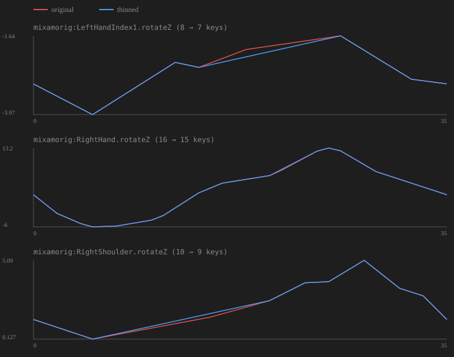

# Export Report — Standard Walk

- **Export time:** 2026-09-07T13:35:14Z
- **Tool version:** 0.1.0
- **Preset:** `ue_mannequin`
- **Skeleton root:** `|mixamorig:Hips`

## Convention

- Up axis: `y`
- Unit: `cm`
- Frame rate: `30`
- Axis conversion: `False` (locked off)

## Validation

**Status:** ⚠️ passed with warnings

| Level | Count |
|-------|-------|
| Error | 0 |
| Warning | 1 |
| Info | 0 |

### Check details

| Check | Level | Passed | Message |
|-------|-------|--------|---------|
| `scene.fps` | error | ✅ | fps = 30 |
| `scene.timeline_range` | warning | ✅ | timeline 0-272 |
| `scene.unit` | error | ✅ | unit = cm |
| `scene.up_axis` | info | ✅ | scene up axis = y (preserved during export) |
| `skeleton.bind_pose` | warning | ✅ | 当前预设没有手臂骨骼映射，量不出姿势，跳过 |
| `skeleton.duplicate_names` | error | ✅ | 65 根骨骼名字唯一 |
| `skeleton.naming` | warning | ⚠️ | 65 根骨骼名字不符合预设 ue_mannequin 的规则 —— 若骨架本身没问题，先确认右上角预设选对了 |
| `skeleton.real_world_scale` | warning | ✅ | 骨架高度 177.9 cm，尺寸合理 |
| `skeleton.root_exists` | error | ✅ | 根骨骼 = \|mixamorig:Hips |
| `skeleton.scale` | warning | ✅ | all 65 joints have unit scale |
| `skeleton.segment_scale` | warning | ✅ | 没有骨骼使用 segmentScaleCompensate |
| `skeleton.single_root` | error | ✅ | 导出根骨架只有一个根节点 |
| `mesh.history` | info | ✅ | 1 个网格历史正常（蒙皮变形器已保留） |
| `mesh.skin_weight` | warning | ✅ | all 1 meshes have normalized weights |
| `mesh.transforms` | info | ✅ | 1 个网格变换正常（蒙皮网格已跳过） |
| `mesh.uv` | info | ✅ | all 1 meshes have UVs |
| `anim.clip_overlap` | warning | ✅ | 1 个片段区间互不重叠 |
| `anim.clip_ranges_valid` | error | ✅ | 1 clip(s) with valid ranges |
| `anim.curves_on_expected` | info | ✅ | all inspected animation curves drive joints |
| `anim.keys_dense` | warning | ✅ | key thinning enabled |
| `anim.keys_in_clip_range` | warning | ✅ | 关键帧都落在片段范围内 |
| `anim.root_motion_match` | info | ✅ | root_motion flags look consistent |
| `anim.skeleton_animated` | error | ✅ | 52/65 根骨骼带动画 |
| `anim.stray_layers` | info | ✅ | no stray animation layers |
| `export.fbx_plugin` | error | ✅ | FBX plugin loaded |
| `export.naming_legal` | error | ✅ | all clip names are legal |
| `export.path_valid` | error | ✅ | 导出到：D:\tool_code\walk.fbx |
| `export.skeleton_root_set` | error | ✅ | 骨架根 = \|mixamorig:Hips |
| `export.ue_path_valid` | error | ✅ | UE 目标 = /Game/Animations，首次交付时由 UE 创建骨架 |

## Clips

| Name | Start | End | Root motion |
|------|-------|-----|-------------|
| `new_clip` | 0 | 35 | — |

## Output

- **FBX:** `D:\tool_code\walk.fbx`
- **FBX written:** yes
- **Export range:** frames 0–35
- **UE destination:** `/Game/Animations`
- **Overwrite policy:** `rename`

## 关键帧抽稀

- **档位：** `medium`
- **Key 数：** 34 → 31（抽掉 3，-8.8%）
- **触及曲线：** 3
- **最大误差：** 0.2309



## UE import

Run the UE-side importer against the manifest:
```
manifest = D:\tool_code\walk_manifest.json
```